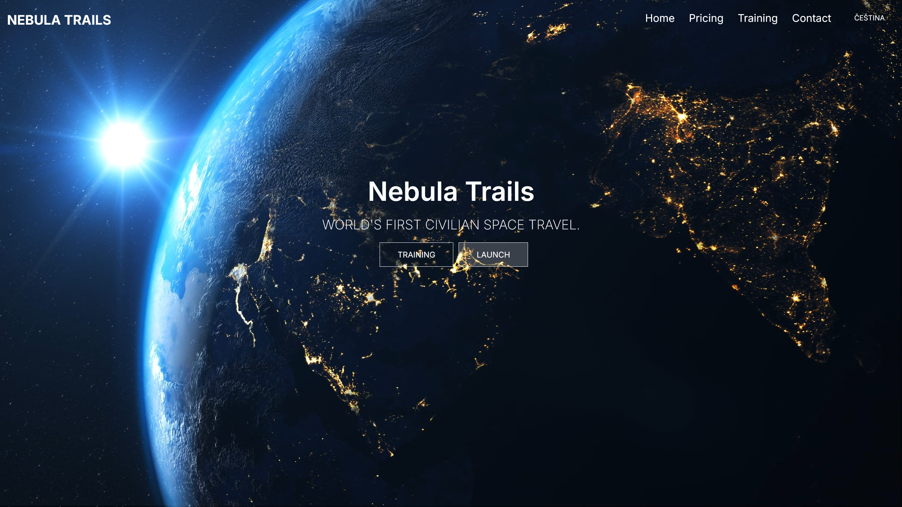

# Nebula Trails


**Nebula Trails** started as a simple landing page and has evolved into a full-fledged application with Stripe payment integration.

### DEMO APP
-   [DEMO-APP DEPLOYMENT](https://nebulatrails-nextjs.vercel.app/en)

## 🛠️ Features/Technologies

### **Features**
- **Stripe payment integration**: Seamless payment handling using Stripe.
- **Dark/Light mode**: While included, this feature is hidden on the main page to maintain visual consistency with image and video backgrounds.
- **Czech language support**: A localized experience for Czech users. i18n library
- **Responsive design**: Optimized for all devices, ensuring a smooth user experience.

### **Technologies Used**
- **Tech Stack**: Next.js 15, TypeScript, Tailwind CSS
- **Styling**: Tailwind CSS for fast and modern UI design.
- **Deployment**: Vercel for production-ready hosting.

---

## 🎯 Why and How Was It Created?

Initially, this project was built using basic HTML, CSS, and React. Over time, it was migrated to **Next.js with TypeScript** for better maintainability and scalability. Key features, such as **Czech language support** and **Stripe payment integration**, were added incrementally to enhance its functionality.

To ensure consistent visual aesthetics, the **dark/light mode** is hidden on the main page to prevent clashes with image and video backgrounds.

---

### Start the app

```shell
npm run dev
```

## 📦 Environment Variables

To set up the project locally, make sure you configure the following environment variables in your `.env.local` file:

```plaintext
NEXT_PUBLIC_STRIPE_PUBLIC_KEY=
STRIPE_SECRET_KEY=

